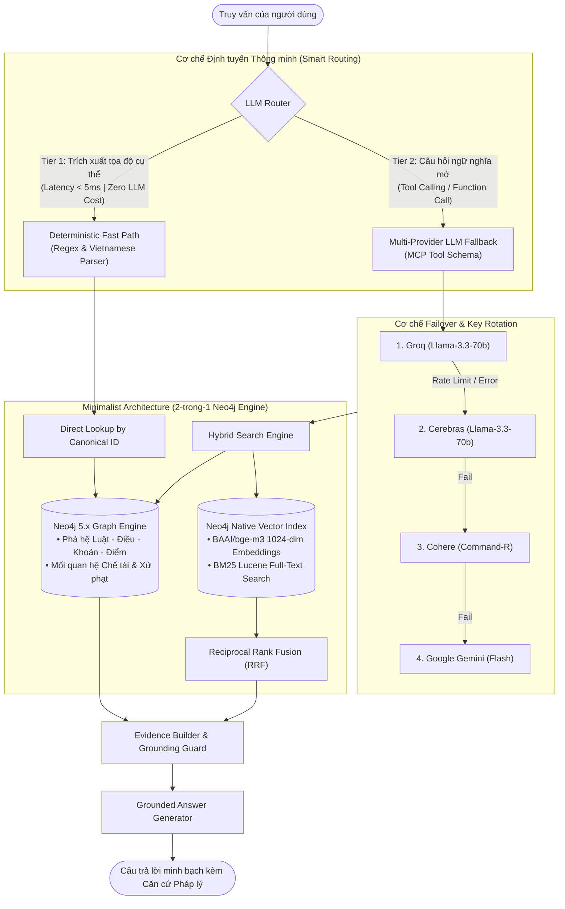

# 🚦 Traffic Law GraphRAG

> **Hệ thống trợ lý AI tra cứu chuyên sâu & chuẩn xác pháp luật giao thông đường bộ Việt Nam — Kết hợp Sức mạnh GraphRAG, Bộ định tuyến Phân luồng Tối ưu Chi phí và Kiến trúc Tối giản 2-trong-1.**

<p align="center">
  
  
  
  
  
  
</p>

---

## 2. 🎬 Demo

<!-- DEMO PLACEHOLDER -->
> 📸 **
**
> 
> 

---

## 3. 🏗️ Kiến trúc hệ thống (System Architecture)

Hệ thống được thiết kế theo tư duy **DevOps-first & Production-ready**, giải quyết triệt để hai bài toán lớn nhất của các giải pháp RAG truyền thống: **Chi phí vận hành LLM** và **Độ phức tạp trong việc duy trì hạ tầng dữ liệu**.



### Điểm nhấn kiến trúc:
1. **Kiến trúc Tối giản "2 trong 1" (Neo4j Dual Engine)**:
   - Thay vì vận hành một cụm Vector Database riêng biệt (như Pinecone, Milvus hay Qdrant) song song với Graph Database, **Traffic Law GraphRAG tận dụng tối đa Neo4j 5.x** để gánh cả hai vai trò: **Lưu trữ tri thức dạng đồ thị quan hệ** và **Truy vấn Vector tương đồng (Cosine Similarity 1024-dim)** cùng **Lucene Full-Text Search**.
   - *Lợi ích:* Cắt giảm 50% chi phí máy chủ, loại bỏ rủi ro lệch đồng bộ dữ liệu (data drift / sync latency) và tinh giản pipeline CI/CD.

2. **Router phân luồng thông minh 2 tầng (Cost & Latency Optimization)**:
   - **Tier 1 (Deterministic Fast Path)**: Bộ tiền xử lý kết hợp Regex và ngữ pháp tiếng Việt phân giải nhanh các truy vấn định danh rõ ràng (ví dụ: *"Điều 5 Nghị định 168"*). Phản hồi với độ trễ `< 5ms`, chi phí API `$0.00` và bảo đảm **Zero-Hallucination**.
   - **Tier 2 (Multi-Provider LLM Fallback)**: Chỉ kích hoạt LLM với các câu hỏi tình huống ngữ nghĩa phức tạp theo chuẩn Model Context Protocol (MCP) Tool Calling.

3. **Cơ chế Failover & Xoay vòng Key liên tục (High Availability)**:
   - Hỗ trợ nạp mảng danh sách nhiều API Key trên mỗi Provider, tự động luân phiên (Round-Robin) để triệt tiêu lỗi `429 Too Many Requests`.
   - Chiến lược Failover tự động chuyển tiếp nhà cung cấp theo thứ tự ưu tiên: **Groq ➔ Cerebras ➔ Cohere ➔ Gemini**, bảo đảm hệ thống hoạt động liên tục 24/7 với độ sẵn sàng cao.

---

## 4. ⚡ Tính năng cốt lõi (Core Features)

- 🔍 **Hybrid Search Đa tầng (BM25 + Vector Cosine)**: Kết hợp sức mạnh của Dense Retrieval (`BAAI/bge-m3` 1024 chiều) và Sparse Retrieval (Lucene BM25) thông qua thuật toán chuẩn hóa **Reciprocal Rank Fusion (RRF)**, đảm bảo bắt trọn cả ngữ nghĩa lẫn từ khóa chuyên ngành pháp lý.
- 🛡️ **Anti-Hallucination thông qua Grounding & Direct Lookup**: Loại bỏ hoàn toàn tình trạng bịa đặt luật bằng cơ chế đối soát chặt chẽ với đồ thị thực thể pháp lý. Cung cấp tính năng tra cứu trực tiếp (Direct Lookup) từng Điều, Khoản, Điểm với mã định danh chuẩn hóa (Canonical ID).
- 🌲 **Duyệt Đồ thị Đa bước (Multi-hop Graph Traversal)**: Cho phép truy vết mối quan hệ phức tạp giữa hành vi vi phạm, mức phạt tiền, hình thức phạt bổ sung (tước quyền sử dụng giấy phép) và biện pháp khắc phục hậu quả.
- 🚀 **Quy trình DevOps & CI/CD Tự động hóa**: Tích hợp toàn diện với GitHub Actions: tự động chạy bộ test suite phân tích tĩnh/động, build image Docker đa tầng tối ưu và deploy trực tiếp tới máy chủ VPS thông qua SSH an toàn.

---

## 5. 🚀 Khởi chạy dự án (Quick Start)

> [!IMPORTANT]
> **Lưu ý về Dữ liệu (`data/`):**
> Do giới hạn kích thước và chính sách bản quyền dữ liệu văn bản pháp luật, **thư mục `data/` không được đính kèm sẵn trên repository GitHub**. Trước khi hệ thống có thể truy vấn, bạn cần **tạo thư mục `data/raw/`**, chuẩn bị các file văn bản pháp luật định dạng `.docx` và chạy pipeline đồng bộ `src.sync` để trích xuất semantic units, nạp đồ thị tri thức (nodes, edges) và lập chỉ mục vector/BM25.

### Bước 1: Sao chép repository
```bash
git clone https://github.com/Tuanxyzc/traffic-law-graphrag.git
cd traffic-law-graphrag
```

### Bước 2: Thiết lập biến môi trường
Tạo file `.env` từ file mẫu `.env.example` và cấu hình các API Key tương ứng:
```bash
cp .env.example .env
```
Chỉnh sửa `.env` để điền ít nhất một API Key hợp lệ (Groq, Cerebras, Cohere, hoặc Gemini) và thông tin đăng nhập Neo4j.

### Bước 3: Chuẩn bị dữ liệu thô (Raw Data)
Tạo thư mục `data/raw` và copy các tệp văn bản pháp luật (ví dụ: các Nghị định, Luật GTĐB dạng `.docx`):
```bash
mkdir -p data/raw
# Đặt các tệp văn bản pháp luật (ví dụ: 168_2024_ND-CP.docx, luat_ttatgt_2024.docx, ...) vào data/raw/
```

### Bước 4: Đồng bộ hóa dữ liệu (1-Click Data Ingestion & Indexing)
Chạy bộ điều phối đồng bộ tự động `src.sync`. Lệnh này sẽ tuần tự:
1. Tự động kiểm tra và khởi động container Neo4j (nếu chưa chạy).
2. Phân tích ngữ nghĩa văn bản pháp luật thành các Semantic Units (`src.parser`).
3. Nạp cấu trúc phân tầng (Văn bản ➔ Điều ➔ Khoản ➔ Điểm) cùng các quan hệ sửa đổi/chế tài vào Neo4j (`src.graph.neo4j.importer`).
4. Khởi tạo nhúng Dense Vector (`BAAI/bge-m3`) và Sparse BM25 Lucene Index (`src.rag.indexer`).

**Cách 1: Chạy trực tiếp từ môi trường Python local:**
```bash
python -m src.sync
```
*(Hoặc sync một văn bản cụ thể: `python -m src.sync --doc 168_2024_ND-CP`)*

**Cách 2: Chạy trực tiếp qua Docker (không cần cài đặt thư viện trên máy host):**
```bash
docker compose up -d neo4j
docker compose run --rm api python -m src.sync
```

### Bước 5: Khởi chạy ứng dụng dịch vụ bằng Docker Compose
Sau khi dữ liệu đã được index đầy đủ vào Neo4j, khởi chạy dịch vụ backend API:
```bash
docker compose up --build -d
```

### Bước 6: Kiểm tra trạng thái hoạt động
Sau khi các container hoàn tất khởi động:
- **FastAPI Documentation (Swagger UI)**: [http://localhost:8000/docs](http://localhost:8000/docs)
- **API Health Check**: [http://localhost:8000/health](http://localhost:8000/health)
- **Neo4j Browser Dashboard**: [http://localhost:7474](http://localhost:7474) *(Tài khoản/Mật khẩu mặc định trong `.env`)*

---

## 6. 📁 Cấu trúc thư mục (Project Structure)

```text
traffic-law-graphrag/
├── .github/
│   └── workflows/
│       ├── ci.yml                 # Pipeline tự động kiểm thử Linting, MyPy & Pytest
│       └── deploy.yml             # Pipeline CD build Docker image & deploy lên VPS
├── docker-compose.yml             # Điều phối liên kết Neo4j & FastAPI container
├── Dockerfile                     # Đóng gói image backend tối ưu CPU-only Torch
├── config.yaml                    # Tham số cấu hình Graph, RAG & Trọng số RRF
├── .env.example                   # Mẫu cấu hình môi trường & Provider API Keys
├── requirements.txt               # Danh sách thư viện phụ thuộc Python
├── src/
│   ├── sync.py                    # 1-Click Orchestrator: Parser -> Ingest Graph -> Vector Indexing
│   ├── api/                       # Tầng giao diện REST API (FastAPI)
│   │   ├── main.py                # Điểm khởi chạy ứng dụng & Lifespan handler
│   │   ├── routes/                # Các endpoint truy vấn RAG, Graph & Healthcheck
│   │   └── middleware/            # Middleware xử lý lỗi tập trung & đo lường latency
│   ├── pipeline/                  # Tầng điều phối thông minh (Orchestrator)
│   │   ├── router.py              # Bộ định tuyến Tier 1 Regex & Tier 2 LLM Function Call
│   │   ├── generator.py           # Sinh câu trả lời bảo chứng (Grounded Generation)
│   │   ├── evidence_builder.py    # Tổng hợp ngữ cảnh từ Vector & Graph traversal
│   │   └── prompts.py             # Hệ thống System Prompts & MCP Tool Schemas
│   ├── rag/                       # Động cơ tìm kiếm lai (Hybrid RAG Engine)
│   │   ├── retriever.py           # Bộ truy hồi kết hợp BM25 & Vector Cosine qua RRF
│   │   ├── embedding.py           # Tích hợp mô hình cục bộ BAAI/bge-m3
│   │   └── indexer.py             # Quản lý khởi tạo Index Full-Text & Vector trong Neo4j
│   ├── graph/                     # Tầng kết nối & truy vấn Đồ thị Tri thức
│   │   ├── neo4j/                 # Quản trị Driver, Session & Connection Pool
│   │   └── identity.py            # Cơ chế chuẩn hóa Canonical ID cho Điều/Khoản/Điểm
│   └── versioning/                # Quản lý phiên bản hóa và hiệu lực văn bản luật
└── tests/                         # Hệ thống Unit Test, Integration Test & Corpus Test
```

---

## 7. 💡 Bài học rút ra & Định hướng tương lai (Lessons Learned & Future Work)

### Điểm tối ưu kỹ thuật nổi bật (Engineering Highlights):
1. **Mount Volume `hf_cache` chống tải lại mô hình Embedding 2.2GB**:
   - Mô hình `BAAI/bge-m3` có kích thước ~2.2GB. Bằng cách định nghĩa persistent volume `hf_cache:/root/.cache/huggingface` trong `docker-compose.yml`, các trọng số mô hình chỉ cần tải một lần duy nhất tại lần khởi chạy đầu tiên. Mọi lần restart container hoặc redeploy phiên bản mã nguồn mới đều tái sử dụng cache ngay lập tức, triệt tiêu thời gian chờ và bảo vệ băng thông mạng máy chủ.
2. **Tối ưu hóa Docker Image với PyTorch CPU-only**:
   - Thay vì cài đặt gói PyTorch tiêu chuẩn (thường nặng hơn 2.5GB do đính kèm các thư viện CUDA/cuDNN không cần thiết trên VPS CPU), `Dockerfile` được cấu hình kéo trực tiếp bản phân phối CPU qua `--index-url https://download.pytorch.org/whl/cpu`. Giải pháp này giúp thu gọn kích thước image hơn 60%, rút ngắn chu kỳ build CI/CD trên GitHub Actions xuống dưới 3 phút.

### Định hướng tương lai (Future Roadmap):
- 👁️ **Multi-modal Traffic RAG**: Mở rộng khả năng xử lý đầu vào hình ảnh thực tế (biển báo hiệu giao thông, tình huống vạch kẻ đường, camera giao thông) kết hợp phân tích đối chiếu luật.
- ⏳ **Temporal Knowledge Graph**: Bổ sung chiều thời gian vào đồ thị tri thức để tự động giải quyết các xung đột pháp lý khi có văn bản, Nghị định mới thay thế hoặc bãi bỏ văn bản cũ.
- ⚡ **Semantic Caching**: Tích hợp tầng đệm ngữ nghĩa (Semantic Cache) với Redis nhằm phản hồi tức thì với độ trễ `< 10ms` cho các câu hỏi vi phạm giao thông thường gặp nhất.
